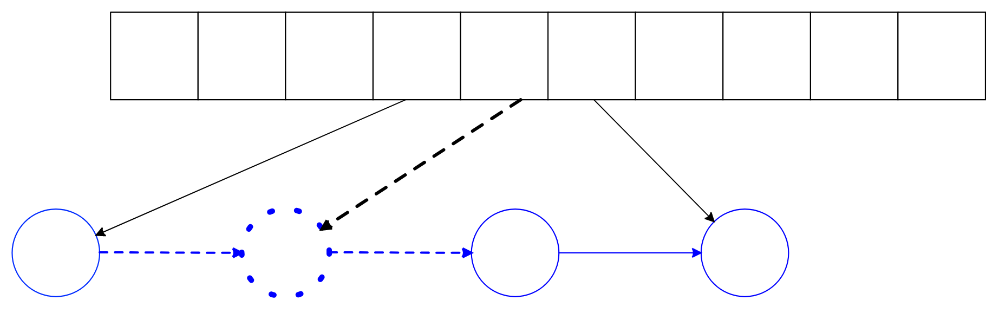
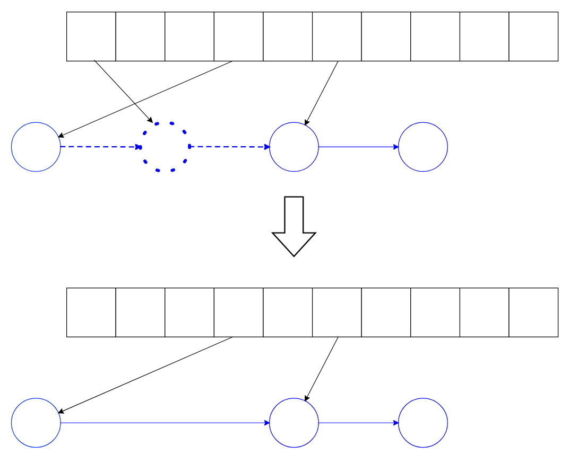
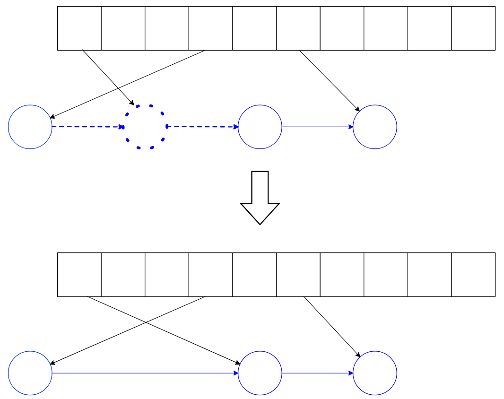

# std::unordered_map custom implementation

### Main idea

How long does it take to iterate through the container? O(n) if it's a one-dimensional data structure like unordered map. That's why we store both `std::vector<bucket_iterator> buckets` and `std::list<node> elements`. The list size equals n, while the vector size is much larger and only depends on the load factor. When the load factor reaches the max load factor, it's time to rehash the table to ensure the buckets don't become too long, as their lengths depend on the number of buckets:

```
auto cached_key = Hasher{}(key) % buckets_.size();
```

### Exception safety

Since all the data structures are STL containers,  exception safety is managed by the standard library, what I see as an absolute win. The main reason for implementing `std::unordered_map` wasn't to study the implementation of standard containers, but rather to understand hash tables. 

Additionally, memory management is handled using allocators as template parameters. We want to take an allocator with the `std::pair<const key, value>` template argument and then, using the provided allocator, allocate not pairs, but _nodes_. Rebind!

```
using traits_t = std::allocator_traits<Alloc>;
using AllocNode = typename traits_t::template rebind_alloc<node_t>;

using table_t = std::list<node_t, AllocNode>;
```

### Insert

If `buckets[cached_key]` is null, meaning there are no buckets with this cached key value, we simply create a new node, which always appears at the beggining of the list:

```
if (buckets_[cached_key] == elements_.end()) {
	elements_.emplace_front(std::make_pair(key, value), cached_key);
	buckets_[cached_key] = elements_.begin();
}
```

Else, we must insert (_emplace_ actually, as we want to avoid redundant copying) the new node at the beginning of `buckets[cached_key]` (keep in mind that the buckets vector stores pointers to the list of actual elements). We then update the buckets[cached_key] iterator since the new element is the new head of the bucket.  

```
buckets_[cached_key] = elements_.emplace(buckets_[cached_key], std::make_pair(key, value), cached_key);
```



### Erase

If there are no elements with the same cached key, we can simply delete an iterator:
```
if (next == elements_.end() || next->cached != cached_key)
    buckets_[cached_key] = elements_.end();
```



Otherwise, the iterator must point to the next element with the same cached key value:
```
buckets_[cached_key] = next;
```



### Rehash

The bottleneck of the unordered_map performance is rehashing the table, which takes O(n<sup>2</sup>) in most implementations, including mine. Here is my algorithm:
1. Resize the buckets vector.
2. Recompute every cached key with respect to the new size.
3. Bind new iterators to list elements.

```
  void rehash() {
    buckets_.resize(buckets_.size() * buckets_.size());
    for (auto& bucket : buckets_) bucket = elements_.end();

    for (auto it = elements_.begin(), end = elements_.end(); it != end; ++it) {
      auto cached_key = Hasher{}(it->kv.first) % buckets_.size();
      auto old_cached_key = it->cached;

      if (buckets_[cached_key] == elements_.end()) {
        auto new_it = find_by_cached_key(old_cached_key);
        buckets_[cached_key] = new_it;
      }
      it->cached = cached_key;
    }
  }
```  
